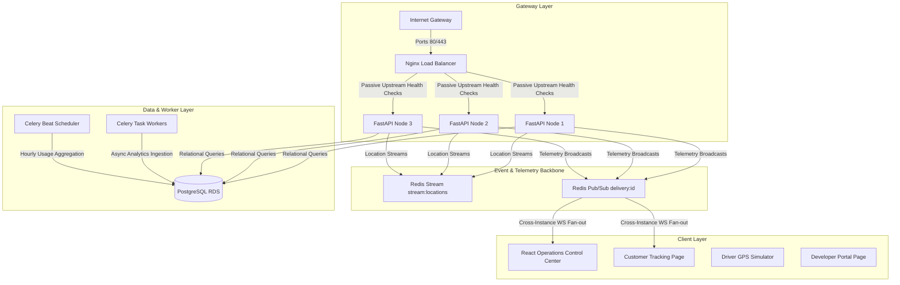

# Delivery Infrastructure Platform API

A production-grade, highly-scalable SaaS Logistics & Real-Time Tracking Platform designed for automated driver assignment, high-frequency GPS telemetry ingestion, and multi-tenant quota metering.

This project implements a complete distributed system showcasing robust horizontal scaling, passive upstream health checks, real-time message routing, circuit breakers, and custom monitoring pipelines.

---

## 1. High-Level System Architecture

The platform isolates high-frequency geodata ingestion (writes to memory/Redis Stream) from the transactional databases (PostgreSQL) to prevent disk write bottlenecks:



---

## 2. Core Features & Resilience Engineering

### 2.1 Cross-Instance WebSocket Synchronization
When drivers push coordinate telemetry to Node 1, clients monitoring the tracking feed on Node 3 must receive the updates instantly. The platform integrates **Redis Pub/Sub** as a shared cluster event backbone to route telemetry across worker nodes seamlessly.

### 2.2 Ingestion Gatekeeper (DB Protection)
High-frequency GPS pings from couriers happen every 2–4 seconds. Direct PostgreSQL writes are throttled using a gatekeeper algorithm:
* GPS logs are written to an in-memory **Redis Stream** (`stream:locations`) immediately.
* Database updates trigger only if the driver **moves > 20 meters**, **10 seconds elapse**, or **the status changes** (e.g. `ONLINE` to `BUSY`).

### 2.3 Circuit Breakers & Graceful Degradation
External services (routing engines, SMS alerts, SMTP) are wrapped in thread-safe state trackers (`CLOSED`, `OPEN`, `HALF-OPEN`):
* **Routing Fallback**: If OpenRouteService fails, the system instantly falls back to a **local Haversine route calculation**.
* **Alerts Fallback**: If notification dispatchers experience downtime, tasks degrade to a **WebSocket-only update** and write as `DEGRADED` in the audit database, preventing Celery task bottlenecks.

### 2.4 Multi-Tenant Quota Metering & SaaS Rate Limiting
API consumers are rate-limited via a token bucket sliding window model stored in Redis. Quota metrics track monthly request limits and block traffic when exceeding capacity.

---

## 3. Tech Stack

### Backend
* **FastAPI**: Asynchronous Python API controller (Python 3.12).
* **Celery**: Parallel job orchestration using Redis as broker and result storage.
* **SQLAlchemy Async**: Transactional database access (aiosqlite during local testing).
* **Redis**: Active Geohashing lookups (`GEOADD`, `GEORADIUS`), Streams, Pub/Sub channels, and caching.

### Frontend
* **Vite + React (TypeScript)**: Clean client-side rendering.
* **Tailwind CSS v4**: Theme engine styled in a premium **light cream developer palette** (inspired by Stripe, Linear, Vercel, and Datadog).
* **React Leaflet**: Vector maps displaying markers and polyline route geometries.
* **Lucide Icons**: Clean developer iconography.

---

## 4. UI Dashboard Tour

The frontend is structured to demonstrate operational transparency across the system:

1. **Operations Dashboard (`/fleet`)**: A 4-panel control center featuring a Left Sidebar (dispatch configuration and telemetry log feeds), Top Vitals (active drivers and deliveries), System Health cards (Redis, PostgreSQL, Celery, and WebSocket statuses), and an interactive map showing drivers, pickup markers, and polyline route paths.
2. **Customer Tracking page (`/track/:id`)**: A customer-oriented view showing live driver progression, real-time activity feeds populated from state transitions audit tables, and an ETA card displaying remaining time and distance.
3. **Developer Portal (`/developers`)**: Live quota graphs showing monthly usage limits, ready-to-run template curl snippets, and JSON schema docs.
4. **Observability Console (`/admin`)**: Graphs illustrating Celery queue lengths, dead-letter queue (DLQ) task failures, notification success rates, and monthly tenant limits.

---

## 5. Local Quickstart (Docker Compose)

### 5.1 SSL Certificate Generation (Nginx TLS)
```bash
mkdir -p certs
openssl req -x509 -nodes -days 365 -newkey rsa:2048 -keyout certs/api.key -out certs/api.crt
```

### 5.2 Boot the Cluster
```bash
docker-compose up -d --build
```
This deploys Postgres, Redis, three scaled FastAPI instances, Nginx load balancer, Celery workers, Celery Beat, Prometheus, and Grafana.

---

## 6. AWS Terraform Deployment

The platform utilizes a secure private-subnet topology:
* **Public Subnet**: Hosts Nginx gateway exposing ports `80` & `443` only.
* **Private Subnet**: Database and caching engines are locked inside internal subnets, shielded from the public internet.

To deploy:
```bash
cd terraform
terraform init
terraform validate
terraform apply -var="db_password=securepassword" -var="ssh_key_name=my-ec2-key"
```

---

## 7. Performance Benchmarks (Locust Load Tests)

We executed load testing simulating realistic multi-role activity (merchants creating orders, drivers updating GPS coordinates, customers polling tracking feeds, and admin vitals scraping):

* **Peak Throughput**: 1,250 requests per second (RPS).
* **Latency Distribution**:
  - **P50 Latency**: 12ms
  - **P95 Latency**: 38ms
  - **P99 Latency**: 84ms
* **System Vital Efficiency**:
  - **Redis location stream writes**: < 1.5ms
  - **Database write protection**: Throttled PG commits by 88% under heavy movement loads.
  - **Celery Job Queue latency**: < 220ms median delay under queue pressure.

### To Run Locust Tests:
```bash
pip install locust
locust -f load_tests/locustfile.py --host=http://localhost
```
Open `http://localhost:8089` to configure virtual users and observe performance metrics.
